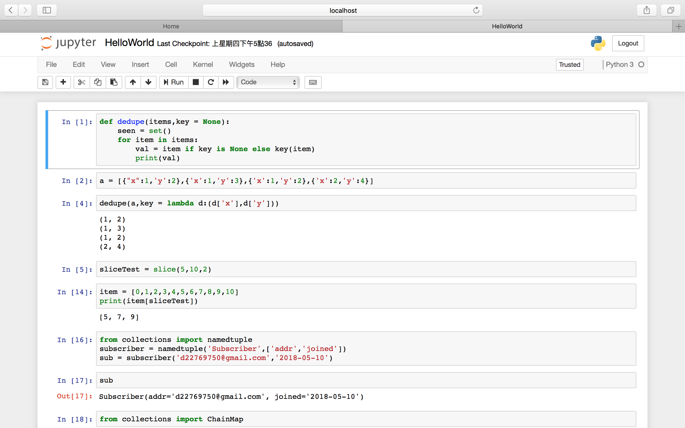

# 開發環境建置

## Anaconda

1. Anaconda是一個集眾多科學運算、數據分析、資料視覺化的Python資源包。
2. 支援Mac, Window, Linux。
3. 支援Python2 與 Python3
4. 自帶jupyter notebook編譯器
5. 闔家歡樂的必備良藥

### 安裝方法

安裝方法很簡單，請前往[Anaconda](https://www.anaconda.com/download/#macos)官方網站，並選擇你電腦的作業系統\(Mac OSX, Windows, Linux\)，接著直接下載你所想要的Python版本即可。

### 環境變數

一般來說，Anaconda的Installer應會直接幫忙新增環境變數，但還是稍微來談論一下環境變數的設置吧。由於筆者的系統是MacOSX，因此會以MacOSX進行介紹。  
  
MacOSX環境變數依生命週期可分為：  
1. 永久型：在配置文檔中進行修改，變數永久生效。  
2. 暫時型：在Terminal中以export進行宣告，變數在該Shell關閉後即會失效，建立的格式如下：

若有多個路經須以冒號：連接，尾端需加入${PATH}，代表支援系統環境變數。

MacOSX環境變數的配置文檔有三個：  
1. /etc/profile  
2. /etc/bashrc  
3. ~/.bash\_profile  
  
其中，前兩個檔屬於系統級別，變數配置對所有使用者皆有效，而.bash\_profile檔則屬於使用者級別，變數配置僅會對該登入使用者生效。

> Note：預設情況下，.bash\_profile檔是不存在的，需透過nano編輯器進行創建。創建方法請開啟Terminal並輸入以下代碼：

```text
$ nano ~/.bash_profile
```

而環境變數的建立格式則如下，若有多個路徑則以冒號:進行連接，句尾需加上$PATH，代表支援系統環境變數。

```text
$ export PATH = "path1:path2:path3:$PATH"
```

以Anaconda2的系統配置來說，指令應為：

```text
$ export PATH="/anaconda3/bin:$PATH"
```

> Note：在檔案儲存後，環境變數並不會立即生效，可退出Terminal後再另啟一個Terminal即會生效。或是輸入source 指令\(source + 環境變數文件\)，其中 source指令已可被稱為「點命令」，因此也可以以 . 作為代替\(如：. /etc/profile\)。

### 配置文檔的編緝方法

以.bash\_profile為例，你可

```text
$ touch ~/.bash_profile; open ~/.bash_profile
```

以文字編輯器進行修改編輯，使用方式與平常修改檔案相同。

```text
$ nano ~/.bash_profile
```

以nano編輯器進行修改編輯，_ctrl+O_為儲存、_ctrl+C_為取消、ctrl+X為退出。

```text
$ vi ~/.bash_profile
```

以vi編輯器進行修改編輯，進入後是無法進行編輯的，需輸入`i, I, o, O, a, A, R`其中一個字母\(vim下會提示對應的操作動作\)，若要退回一般模式，按Esc即可。而在一般模式下，輸入`:/?`三個其中一個字母時，就可將游標移到最下面，並進入指令列命令模式，在此模式下可進行儲存/讀取檔案。  
這邊我們僅先知道  
1. `:wq`：儲存檔案並退出。  
2. `:w`：儲存檔案  
3. `:q`： 離開  
4. `:q!`：曾修改過檔案但不想儲存時，則以此退出。

### 開發環境

當安裝完Anaconda後，我們就可以來編寫Python囉~

#### 互動式終端介面

我們可以使用終端機開啟互動指令介面來編寫Python，如下圖可以看到若建置安裝完Anaconda後，就會出現Anaconda的字眼。

```text
$ Python
Python 3.6.4 |Anaconda, Inc.| (default, Jan 16 2018, 12:04:33)
[GCC 4.2.1 Compatible Clang 4.0.1 (tags/RELEASE_401/final)] on darwin
Type "help", "copyright", "credits" or "license" for more information.
>>> 
```

#### 執行.py檔

我們亦可使用.py檔來執行Python程式。

```text
$ Python Hello_World.py
#上述終端機代碼即是執行Hello_World的python檔
```

.py 檔可透過任何文字編輯器編寫，筆者推薦的文字編輯器為Sublime，其擁有優美的介面與一些方便編寫程式的指令。


#### IDE \(Integrated Development Environment\)集成

IDE是一種輔助開發人員進行開發編寫程式的應用程式，其通常包括程式語言編輯器、除錯器、編譯器等。  
  
Python的IDE有很多，較為知名的有PyDev、IPython Notebook等等。  
筆者推薦的IDE為IPython Notebook，其介面亦相當簡潔且可實時打印程式的輸出結果。好消息是，Anaconda已有附帶IPython Notebook，僅需在終端機中輸入以下代碼即可打開。

```text
$ jupyter Notebook
```



> 在IPython Notebook中的每格程式碼皆可實時執行，僅需按_Shift+Enter_。

## 第一個程式

當開發環境都建置完後，我們可以開始編寫程式囉～一開始不免俗就是要來Hello World一下囉，基本上所有程式人一開始所學的就是要如何在結果輸出顯示Hello World哈哈XD。  
方法非常的簡單，如下：

```text
>>> 'Hello World'
```

